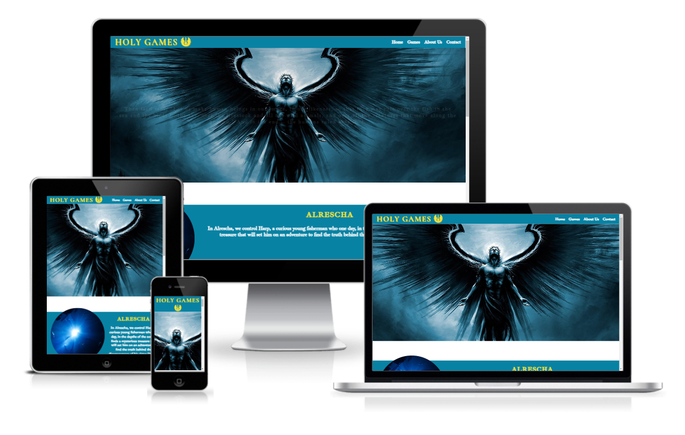
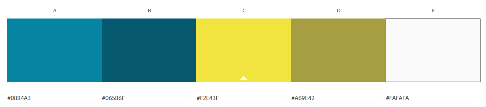
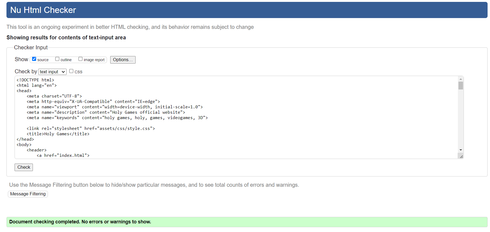
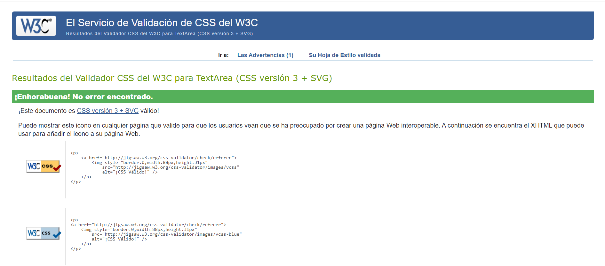

<h1 align="center">1P Juan Jose Ruiz Ruiz - Holy Games</h1>

[View the live project here.](https://deneb331.github.io/1P-JuanJoseRuiz-HolyGames/)

Holy Games is a Game Development company who has been working in two fantasy japanese-RPG games: Heart Lights and Alrescha.

<h2 align="center"></h2>

<h2 align="center"></h2>

## User Experience (UX)

-   ### User stories

    -   #### First Time Visitor Goals

        1. As a First Time Visitor, I want the user to have a strong visual impact with the first sight.
        2. As a First Time Visitor, I want to be able to get all the content of the website in the least time possible.

    -   #### Returning Visitor Goals

        1. As a Returning Visitor, I want to be able to ask questions about the games developed or future projects to the team.
        2. As a Returning Visitor, I want to be able to find quickly details about the games.
        3. As a Returning Visitor, I want to find easily the social media of the company.

    -   #### Frequent User Goals
        1. As a Frequent User, I want to check if there are new updates about new projects.

-   ### Design
    -   #### Colour Scheme
        -   The three main colors used are blue, yellow and white, trying to give an angelical, good and sacred feeling.
        <h2 align="center"></h2>

    -   #### Typography
        -   The Ibarra Real Nova font is the primary font used throughout the website, with the Sans Serif as a backup font in case, for some reason, the font is not properly imported to the site. This font is reminiscent of the typography used in holy book reprints, adding a more angelic and sacred feel to the website. The font used for the logo is Cormorant SC, used for the same reason as the Ibarra font, I chose to have a different font for the logo to give it more importance.

    -   #### Imagery
        -   The large hero image's main intention is to give a strong visual impact to the visitor in the first sight. It has an hover effect with zoom and some hidden text to increase the curiosity of the visitor.

## Features

-   Responsive on all device sizes

-   Interactive elements

## Technologies Used

### Languages Used

-   [HTML5](https://en.wikipedia.org/wiki/HTML5)
-   [CSS3](https://en.wikipedia.org/wiki/Cascading_Style_Sheets)

### Frameworks, Libraries & Programs Used

1. [Hover.css:](https://ianlunn.github.io/Hover/)
    - Hover.css was used on the header hero image to make a zoom effect and show hidden text to the visitor.
1. [Google Fonts:](https://fonts.google.com/)
    - Google fonts were used to import the 'Ibarra Real Nova' and 'Cormorant SC' fonts into the style.css file which is used on all pages throughout the project.
1. [Font Awesome:](https://fontawesome.com/)
    - Font Awesome was used on all pages throughout the website to add icons for aesthetic and UX purposes.
1. [Git](https://git-scm.com/)
    - Git was used for version control by utilizing the Gitpod terminal to commit to Git and Push to GitHub.
1. [GitHub:](https://github.com/)
    - GitHub is used to store the projects code after being pushed from Git.
1. [Photopea:](https://www.photopea.com/)
    - Photopea was used to remove the background to the logo, so it can be used in this document.
1. [Pexels:](https://www.pexels.com/es-es/)
    - Pexels was used to find the images needed for the website.
1. [Adobe Color Wheel:](https://color.adobe.com/es/create/color-wheel)
    - Adobe Color Wheel was used to create the color palette for the website.
1. [TinyPNG:](https://tinypng.com/)
    - TinyPNG was used to optimize the images used in the website.

## Testing

The W3C Markup Validator and W3C CSS Validator Services were used to validate every page of the project to ensure there were no syntax errors in the project.

-   [W3C Markup Validator](https://jigsaw.w3.org/css-validator/#validate_by_input)
        <h2 align="center"></h2>
-   [W3C CSS Validator](https://jigsaw.w3.org/css-validator/#validate_by_input)
        <h2 align="center"></h2>

### Testing User Stories from User Experience (UX) Section

-   #### First Time Visitor Goals

    1. As a First Time Visitor, I want the user to have a strong visual impact with the first sight.

        1. Upon entering the site, users find a epic hero image of an angel that catches his/her attention.
        2.  The hero image has a zoom effect when the mouse is hover it, and it shows a hidden text with a passage of the Bible, with a little change at the end that makes the user more curious.

    2. As a First Time Visitor, I want to be able to get all the content of the website in the least time possible.

        1. All the website has been built in one page, so the user doesn't get lost navigating around many pages.
        2. At the top of the website, the user can find a navigation menu with a link to every section in the website, so he can go straight away to the section he/she is interested the most.
        3. Every section is designed to fit in the screen on it's own, so the user can see all the content of the section he/she is looking without scrolling.

-   #### Returning Visitor Goals

    1. As a Returning Visitor, I want to be able to ask questions about the games developed or future projects to the team.

        1. In the nav bar, the user can find a link to the contact section.
        2. In the contact section, the user can find a form to ask anything to the team.

    2. As a Returning Visitor, I want to be able to find quickly details about the games.

        1. In the nav bar, the user can find a link to the games section.
        2. Also, the games section is the first one after the hero image, so is the first one the user finds scrolling down when he/she enters the website.
        3. The games section contains a description and an image of each game, to give the user a quick idea of the story and the visuals of each game.
        4. The footer contains links to Youtube, Twitter and Instagram accounts.
        5. Whichever link they click, it will be open up in a new tab to ensure the user can easily get back to the website.

    3. As a Returning Visitor, I want to find easily the social media of the company.
        1. The user can find the social media links in the footer of the website, just under the contact section.

-   #### Frequent User Goals

    1. As a Frequent User, I want to check if there are new updates about new projects.

        1. As the website doesn't have lots of content, the user can find new information easily.
        2. The user can directly ask the team in the contact section.
        3. The user also can follow the team on the social media he/she can find in the footer, to watch all the new updates the team post there.

### Further Testing

-   The Website was tested on Google Chrome, Microsoft Edge and Opera browsers.
-   The website was viewed on a variety of devices such as Desktop, Laptop and Xiaomi Redmi Note 10.
-   A large amount of testing was done to ensure that all pages were linking correctly.
-   Friends were asked to review the site and documentation to point out any bugs and/or user experience issues.

### Bug Log

- Text doesn't fit inside the box in the header - fixed after depuring code with inspector in chrome, and redoing all placement code step by step.
- Bug with animation for header with mouse hover, where the cover text doesn't react when the mouse is hover. - fixed after changing the animation method, using transitions instead of keyframes for color.
- When load the page, the transitions load as the mouse is hover by default. - fixed after rewriting the transition code from scratch.
- Images in game and about us sections have problems with the aspect ratio. - used html images and object-fit:cover; instead of css background-image to make it work.
- Form alignment is not consistent in all resolutions - removed max and min width and used percentages to set up the width of the form and inputs.

## Deployment

### GitHub Pages

The project was deployed to GitHub Pages using the following steps...

1. Log in to GitHub and locate the [GitHub Repository](https://github.com/)
2. At the top of the Repository (not top of page), locate the "Settings" Button on the menu.
3. Locate the "Pages" Section in the lateral menu.
4. Under "Source", click the dropdown called "None" and select "Main Branch".
5. The page will automatically refresh.
6. Scroll back down through the page to locate the now published site [link](https://deneb331.github.io/1P-JuanJoseRuiz-HolyGames/) in the "GitHub Pages" section.

## Credits

### Code

-   The main structure of the page is based in the one made in the Love and Running project, changed to fit my own design and adding new things.

-   [W3Schools](https://www.w3schools.com/) : For research about new features not given in the course.

### Content

-   All content was written by the developer, based in the projects and templates given by Code Institute.

### Media

-   All Images were downloaded from [Pexels](https://www.pexels.com/es-es/).

### Acknowledgements

-   My Mentor for continuous helpful feedback and resources.
-   The Slack community for the instant help whenever I needed it.
